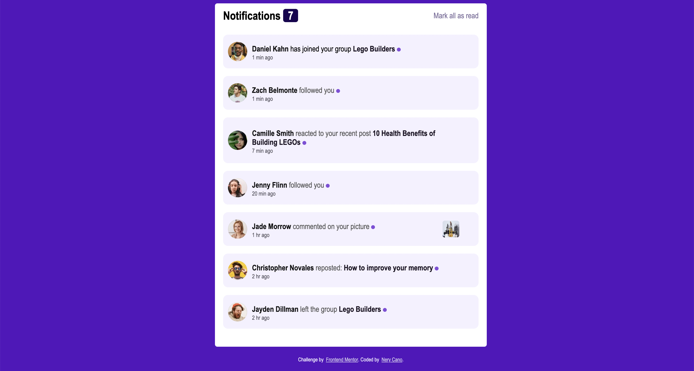

# Notifications page solution - Frontend Mentor

This is a solution to the [Notifications page challenge on Frontend Mentor](https://www.frontendmentor.io/challenges/notifications-page-DqK5QAmKbC).

## Table of contents

-   Overview
    -   [The challenge](#the-challenge)
    -   [Screenshot](#screenshot)
    -   [Links](#links)
-   [My process](#my-process)
    -   [Built with](#Built with)
    -   [What I learned](#what-i-learned)
    -   [Continued development](#continued-development)
    -   [Useful resources](#useful-resources)
-   [Author](#Nery Cano)

**Note: Delete this note and update the table of contents based on what sections you keep.**

### The challenge

Users should be able to:

-   Distinguish between "unread" and "read" notifications
-   Select "Mark all as read" to toggle the visual state of the unread notifications and set the number of unread messages to zero
-   See hover and focus states for all interactive elements on the page

### Screenshot



### Links
[Notifications project](https://neryje.github.io/notifications-project/)

## My process

-Design the wireframe on figma
-Design the viewport for dekstop
-add html content
-add the css designs by implementing flexbox system
-Finished with Js logic

### Built with

-   Semantic HTML5 markup
-   CSS custom properties
-   Flexbox
-   Js

### What I learned

-I learned to improve my skills with flexbox, getting understanding to implement better structure.
-I learn to used pseudo-classes like :first-of-type. In this case I added a style using the ::after pseudo element, which I also put in more practice.
-I learned how to used the foreach method by calling the elements.

```css
.unread p:first-of-type::after {
    content: "";
    background-color: #190351;
    width: 8px;
    height: 8px;
    display: inline-block;
    border-radius: 50%;
}
```

```js
unread.forEach((Users) => {
    Users.addEventListener("click", () => {
        Users.classList.remove("unread");
    });
});
```

### Continued development

As I continued building more projects, I want to focus on keep learning more about DOM manipulation. And
combine my design skills with coding.

### Useful resources

-   https://developer.mozilla.org/en-US/docs/Web/CSS/:first-of-type - This source helped me to understand pseudo-classes.

## Author

-   Website - [Nery Cano](https://www.your-site.com)
-   Frontend Mentor - [@Nery](https://www.frontendmentor.io/profile/Nery)
